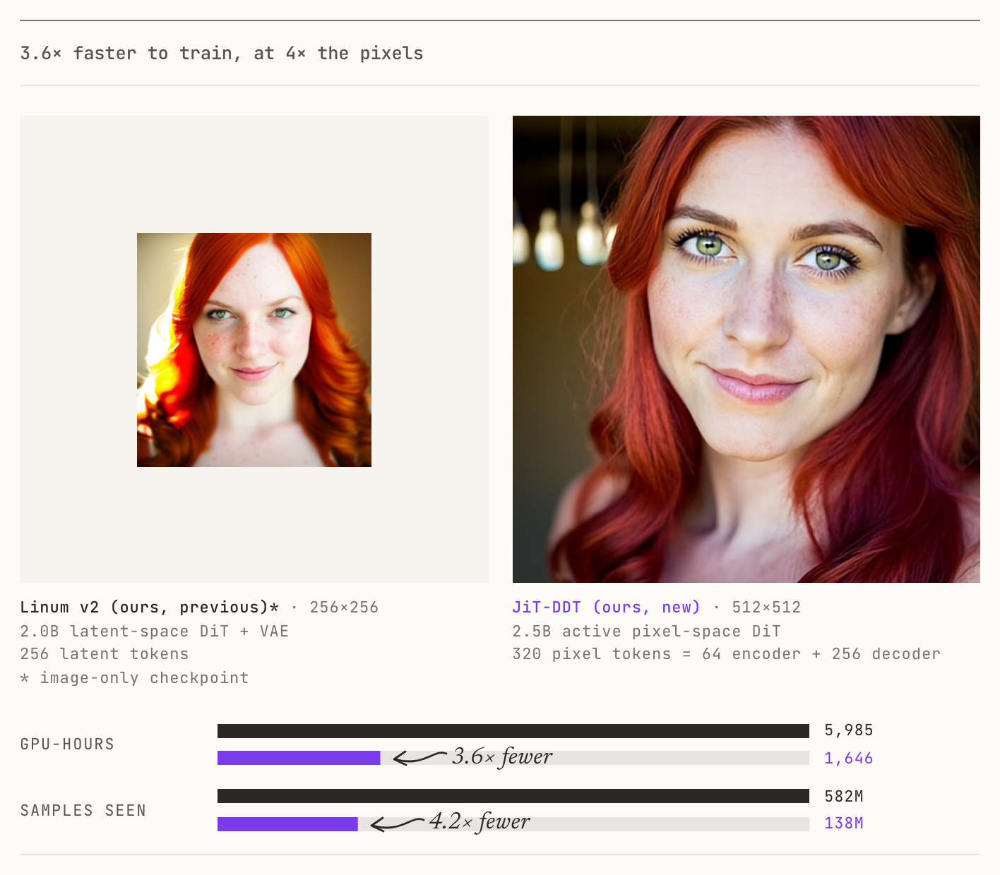

<div align="center">

# JiT-DDT: Training Text-to-Image Models 3.6x Faster

**[Sahil Chopra](https://thesahilchopra.com/) · [Manu Chopra](https://www.linkedin.com/in/manu-chopra-50360b170/)**

*Linum*

[](https://www.linum.ai/field-notes/jit-ddt)
[](https://huggingface.co/Linum-AI/jit-ddt)
[](LICENSE)

</div>



*The same prompt from Linum v2 (2.0B latent-space DiT + VAE, 256x256) and from JiT-DDT
(pixel-space, 512x512). JiT-DDT reached this quality in 3.6x fewer GPU-hours and 4.2x fewer
samples, at 4x the pixels. The write-up is in the
[blog post](https://www.linum.ai/field-notes/jit-ddt).*

> [!IMPORTANT]
> **This is a research artifact, not a full model release.** This model was
> trained for 138M samples and has not been post-trained. Rather, this is a research preview on
> the road to our v3 model. We're releasing it because we want to share our preliminary findings
> with the broader field and encourage others to explore efficient training methods like ours.

JiT-DDT is a 2.5B-parameter **pixel-space** text-to-image diffusion transformer from Linum.
It generates 512x512 images directly in RGB (no VAE) using a pair of diffusion transformers
trained jointly:

* an **encoder** DiT that reads the noisy image at coarse 64x64-pixel patches (64 tokens at
  512x512) together with the caption and produces a *structural plan*: its final-block tokens,
  which also decode to an 8x-downsampled image;
* a **decoder** DiT that reads the same noisy image at 32x32-pixel patches (256 tokens), the
  caption, and the encoder's 64 plan tokens appended in-context at matching positions, and
  predicts the clean image.

Both DiTs predict the clean image directly (x-prediction) and are trained with a
velocity-space loss; see [`loss.py`](loss.py) for the full objective.

## Getting started

```bash
# Debian/Ubuntu: Triton compiles a small CUDA shim at first use and needs a C
# compiler plus the CPython headers.
sudo apt-get install -y build-essential python3-dev

git clone https://github.com/Linum-AI/jit-ddt && cd jit-ddt
python3 -m venv .venv && source .venv/bin/activate
pip install -e .            # torch >= 2.10, transformers >= 5.5, safetensors, huggingface_hub
```

```bash
PROMPT="A close-up portrait of a young white woman with vibrant, fiery red hair cascading over \
her shoulders in soft waves, framed from the shoulders up and centered against a softly blurred \
warm-toned background. Her fair, lightly freckled complexion sets off piercing green eyes and a \
subtle, closed-lipped smile. Soft natural light enters from the left of the frame, highlighting \
the texture of her hair and the curve of her cheek while leaving the right side in gentle shadow. \
A shallow depth of field renders the background into smooth, neutral bokeh. Lights dangle out of \
focus on the left side of the frame."
python generate.py --weights Linum-AI/jit-ddt --qwen_model_path Qwen/Qwen3.5-4B \
    --prompt "$PROMPT" --seeds 42,123 --out_dir outputs
```

That is all it takes on any CUDA GPU with ~24 GB of memory (10 GB of fp32 weights plus the
8 GB Qwen3.5-4B text encoder) and ~18 GB of free disk for the Hub cache. The weights
download from the Hugging Face Hub
([`Linum-AI/jit-ddt`](https://huggingface.co/Linum-AI/jit-ddt)) and the text encoder is the
stock `Qwen/Qwen3.5-4B` checkpoint; both repositories are public, so no `HF_TOKEN` is
required (`huggingface_hub` warns about anonymous requests, which only affects rate limits
and download speed). The prompt is the `woman_red_hair` validation prompt used
throughout training and in the blog post. Attention runs on FlashAttention-3 when it is installed and on PyTorch
SDPA otherwise; see [Attention backends](#attention-backends) for the difference.

## Architecture

| | Encoder | Decoder |
|---|---|---|
| Input patch | 64x64 px (64 tokens @ 512²) | 32x32 px (256 tokens @ 512²) |
| Output patch | 8x8 px (predicts 64x64 image) | 32x32 px (predicts 512x512 image) |
| Width / layers / heads | 2944 / 11 / 23 (head dim 128) | same |
| FFN | SwiGLU, hidden 5376 | same |
| Sequence | [image 64 \| caption 256] | [image 256 \| caption 256 \| plan 64] |
| Parameters | 1.24B | 1.25B |

Note that the training checkpoint also carried a 241M-parameter PixelREPA masked transformer
adapter on the encoder (the representation-alignment loss's projection head); it plays no part
in sampling and is not included. A reference implementation of it lives in
[`loss.py`](loss.py).

## Training objective (reference only)

[`loss.py`](loss.py) writes out every loss term as it was computed during training, with the
released model's hyperparameters: logit-normal timesteps shared by both DiTs, x-prediction with
the 1/t² velocity weighting, the encoder's 8x-downsampled target, pixel-space representation
alignment to DINOv2 through a masked adapter, LPIPS and DINO perceptual terms gated on
t ≤ 0.7, caption dropout to zeros, and the EMA that produced the released weights. No training
code is included.

## Sampling

Plain Euler ODE, 50 uniform steps from t = 1 (noise, drawn with scale 2) to t = 0.

At each step the model's x_0 prediction is converted to a velocity, v = (x_t - x_0) / t, and
the conditional / unconditional branches are combined with **adaptive projected guidance**
(APG, [Sadat et al. 2025](https://arxiv.org/abs/2410.02416)) at scale 15 (momentum -0.75,
rescale 10, parallel component dropped).

The unconditional branch is a real negative prompt (`"watermark, signature, logo, copyright,
url"`). Everything runs under bf16 autocast with fp32 master weights.

## Attention backends

| `--attention_backend` | Needs | Result |
|---|---|---|
| `sdpa` | nothing extra | the same images to within kernel rounding (38-48 dB PSNR vs the reference set; see the table below) |
| `flash3` | FlashAttention-3, Hopper GPU | what the model was trained and validated with; bit-exact reference reproduction (see below) |
| `auto` (default) | nothing extra | `flash3` if importable, else `sdpa` |

FlashAttention-3 has no prebuilt wheels; build it from the public repository (H100/H200,
~20-40 minutes with a many-core CPU, ~4 GB RAM per parallel job):

```bash
pip install ninja
git clone https://github.com/Dao-AILab/flash-attention.git && cd flash-attention
git checkout e2743ab5b380            # v3.0.0, the build the reference images used
git submodule update --init csrc/cutlass
cd hopper && TORCH_CUDA_ARCH_LIST="9.0a" MAX_JOBS=16 NVCC_THREADS=16 pip install --no-build-isolation .
python -c "import flash_attn_interface"   # success => `auto` now picks flash3
```

## Troubleshooting

**`subprocess.CalledProcessError ... /usr/bin/gcc ... driver.c` partway through sampling.**
Triton builds a CUDA driver shim on first kernel launch (the Qwen3.5 text encoder's RoPE
goes through one) and hides the compiler's error output. The usual cause is missing
CPython headers: `sudo apt-get install -y build-essential python3-dev`.

## Python API

```python
from jit_ddt import JitDDT, QwenTextEncoder, SamplerConfig, generate

model = JitDDT.from_pretrained("Linum-AI/jit-ddt")       # or a local weights directory
text_encoder = QwenTextEncoder("Qwen/Qwen3.5-4B")
prompt = (
    "A close-up portrait of a young white woman with vibrant, fiery red hair cascading over her "
    "shoulders in soft waves, framed from the shoulders up and centered against a softly blurred "
    "warm-toned background. Her fair, lightly freckled complexion sets off piercing green eyes and "
    "a subtle, closed-lipped smile. Soft natural light enters from the left of the frame, "
    "highlighting the texture of her hair and the curve of her cheek while leaving the right side "
    "in gentle shadow. A shallow depth of field renders the background into smooth, neutral bokeh. "
    "Lights dangle out of focus on the left side of the frame."
)
images = generate(model=model, text_encoder=text_encoder, prompt=prompt, seeds=[42],
                  sampler=SamplerConfig())          # list of (3, 1, H, W) uint8 tensors
```


`JitDDT.from_pretrained` accepts a Hub id or a local weights directory. Height and width must
be multiples of 64. `SamplerConfig` exposes the step count, guidance scale, APG parameters and
noise scale; the defaults are what the model was validated with. Each image takes 100 forward
passes of the 2.5B model (50 steps x conditional/unconditional), a few seconds on an H100.

## Authorship

This repository was written by Claude (Anthropic's Fable 5.1 model, running in Claude Code).
Linum asked it to extract the model, inference code and training loss from Linum's internal
experiment repository, delete every knob the released model does not use, and prove the result
faithful: the extracted model was verified against the internal one tensor-for-tensor on
identical inputs at extraction time. The model, the training, and the review of this repository are Linum's.

## License

Apache-2.0. Copyright 2026 Linum Inc.
